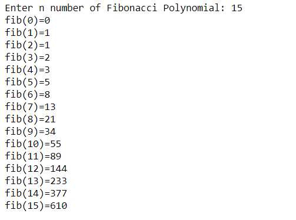
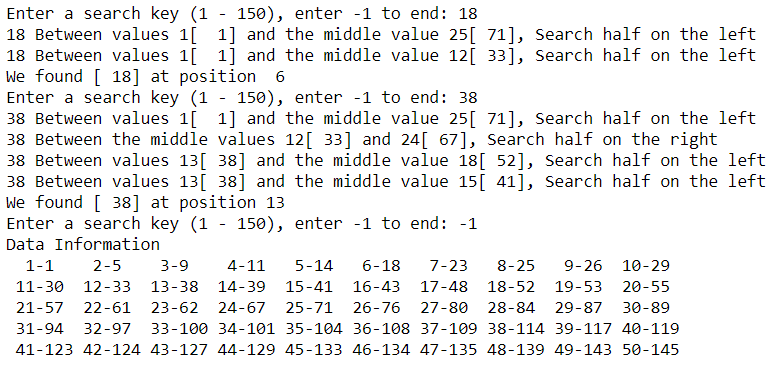
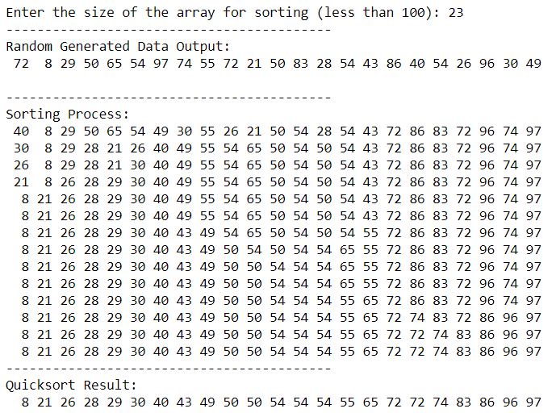
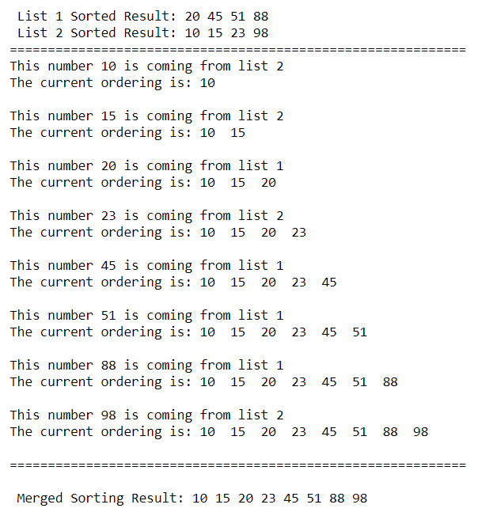
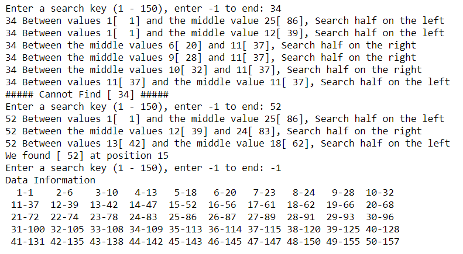
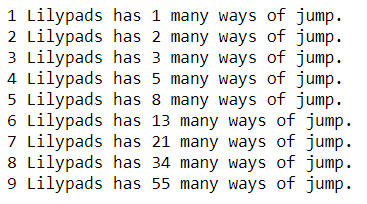
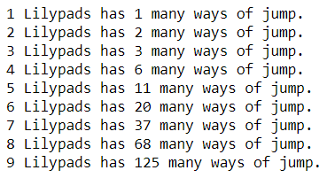

# The Basic Algorithms with Python

### I. Fibonacci Polynomial

In mathematics, the Fibonacci polynomials are a polynomial sequence which can be considered as a generalization of the Fibonacci numbers. The polynomials generated in a similar way from the Lucas numbers are called Lucas polynomials. (Wikipedia)

### II. Tower of Hanoi

The objective of the puzzle is to move the entire stack to another rod, obeying the following simple rules:

1. Only one disk can be moved at a time.
2. Each move consists of taking the upper disk from one of the stacks and placing it on top of another stack or on an empty rod.
3. No larger disk may be placed on top of a smaller disk.

With 3 disks, the puzzle can be solved in 7 moves. The minimal number of moves required to solve a Tower of Hanoi puzzle is (2^n) − 1, where n is the number of disks.

### III. Quicksort

"Quicksort" is developed by British computer scientist Tony Hoare in 1959. It is also known as "divide-and-conquer algorithm". It first divides the input arrange into two smaller sub-arrays: the low elements and the high elements. It then recursively sorts the sub-arrays.

### IV. Merge Sort
Merge sort is another divide-and-conquer algorithm commonly used in data science. The idea of merge sort is based on the idea of breaking down a list into several sub-lists until each sublist consists of a signle element and merging those sublists in a manner that results into a sorted list.

### V. Binary Search
In the process of data management, we need to use the shortest time to locate and search for the needed information. The term "search" basically refers to an action for locating the needed inforamtion ("Key") from the data set or data base. Binary search, also known as half interval search, is a search algorithm that finds the position of a target value within a sorted array.

### VI. Frog Jump
Frog Jumps algorithm is part of the greedy algorithms. The frog begins at position 0 in the river. Its goal is to get to position n. There are lilypads at various positions. There is always a lilypad at position 0 and position n. The frog can jump at most r units at a time. The goal for this algorithm is to find the path the frog should take to minimize jumps, assuming a soultion exits.

